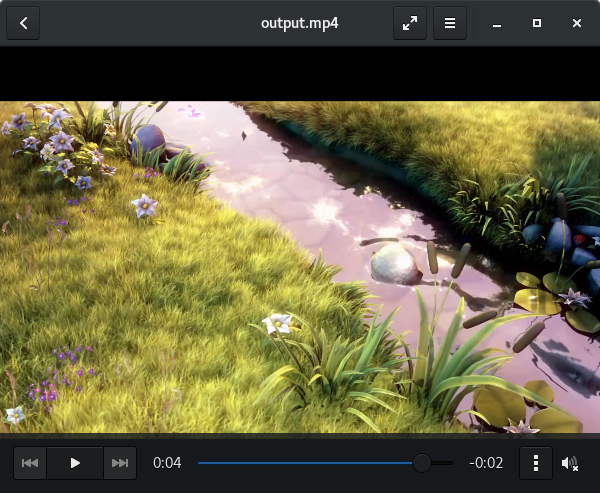
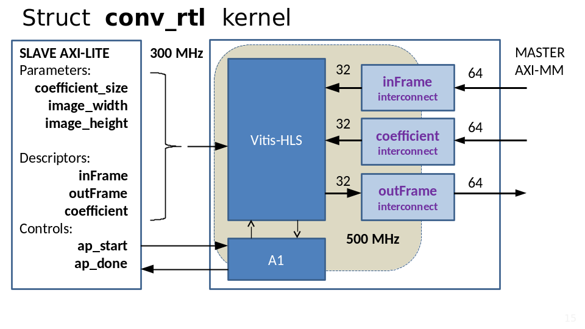

# Transform 300 MHz HLS kernel to 500 MHz RTL kernel

## Original project

Xilinx has a step-by-step guide on how to create an accelerating kernel for an Alveo board.

 https://github.com/Xilinx/Vitis-Tutorials/tree/master/Hardware_Accelerators/Design_Tutorials/01-convolution-tutorial

There are several steps:
* baseline
* fixedpint
* **dataflow**  - base for current project
* multicore
* qdma

The main acceleration function is video convolution.

* resolution: 1920x1080
* 132 frames 
* source video: 30 FPS
* destination video: 25 FPS

## RTL kernel structure 

* Vitis-HLS - original kernel
* A1 - fsm component for translate control signal from 300 MHz to 500 MHz
* inFrame, outFrame, coefficint - AXI interconnect from 32bit/500MHz to 64bit/300MHz
* SLAVE AXI-LITE - component for decode function parameters and execution control

## Workspaces

* wsp_hls - for Vitis-HLS projects
* wsp_vitis - for Vitis projects
* project_ip - for Vivado IP cores

## Vitis-HLS

* conv_01 - project with original source core from Xilinx tutorial

## Vitis

* convolution_rtl_01 - Vitis project, Vivado RTL kernel project

## project_ip

* convolve_fpga - result of cov_01 project
* static_line - additional component for translate static signal from one clock to another clock

## Results

* [system_view](./doc/system_view.md) 
* [application timeline](./doc/application_timeline.md)
* [console_output](./doc/console_output.md)
* [fpga_utilization](./doc/fpga_utilisation.md)

## Directories
### top directory
* doc - documentation
* lab - place for laboratory 
* reference - source code for laboratory
### reference directory
* conv_01 - source code for HLS project
* conv_rtl - source code for RTL kernel
* convolution_rtl_01 - source code for Vitis application project
* project_ip - additional IP Core

## Instructions

* [Create HLS project](./doc/create_hls.md) 
* [Create Vitis application project](./doc/create_app_project.md) 
* [Create RTL kernel](./doc/create_rtl.md) 
* [Create HW-Link project](./doc/create_hw_link.md) 
* [Build  application project](./doc/build_app_project.md) 
* [Run example](./doc/run_example.md) 

