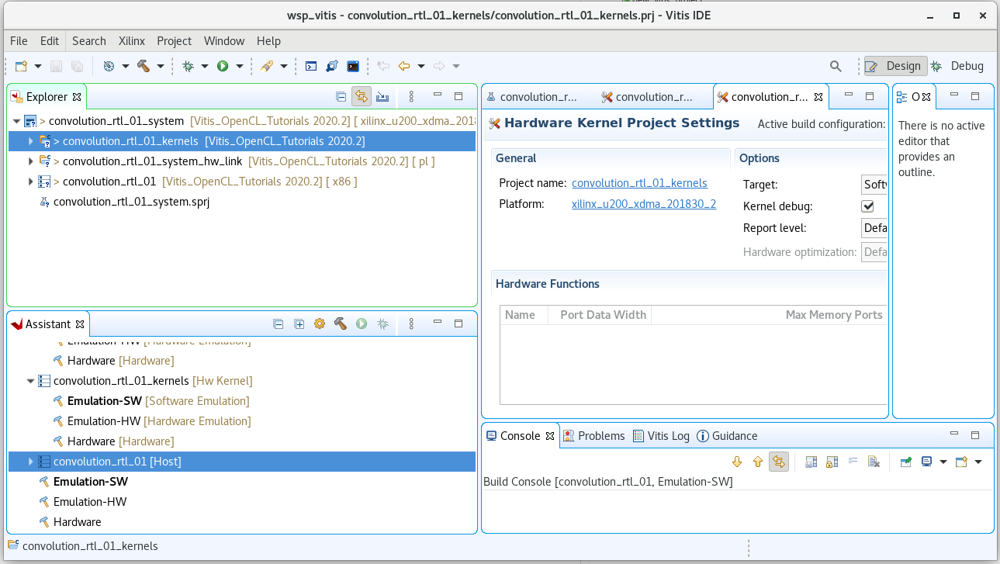

# Create Vitis Application project
* open terminal
* setup environment : source /tools/Xilinx/Vitis/2020.2/settings64.sh 
* launch :           vitis &
* enter workspace:  __<path>/lab/wsp_vitis__
* launch "Create Application Project"
* next page
* select platform __xilinx_u200_xdma_201803_2__  (you must setup platfrom before launch)
* enter project name  __convolution_rtl_01__
* select "Empty Application"
* workspace was created, there are four projects into the workspace:
    - convolution_rtl_01_kernels - for kernels
    - convolution_rtl_01_system_hw_link - for binary_container
    - convolution_rtl_01 - for host program
    - convolution_rtl_01_system - top-level project

* Next step: [Create RTL kernel](./create_rtl.md) 