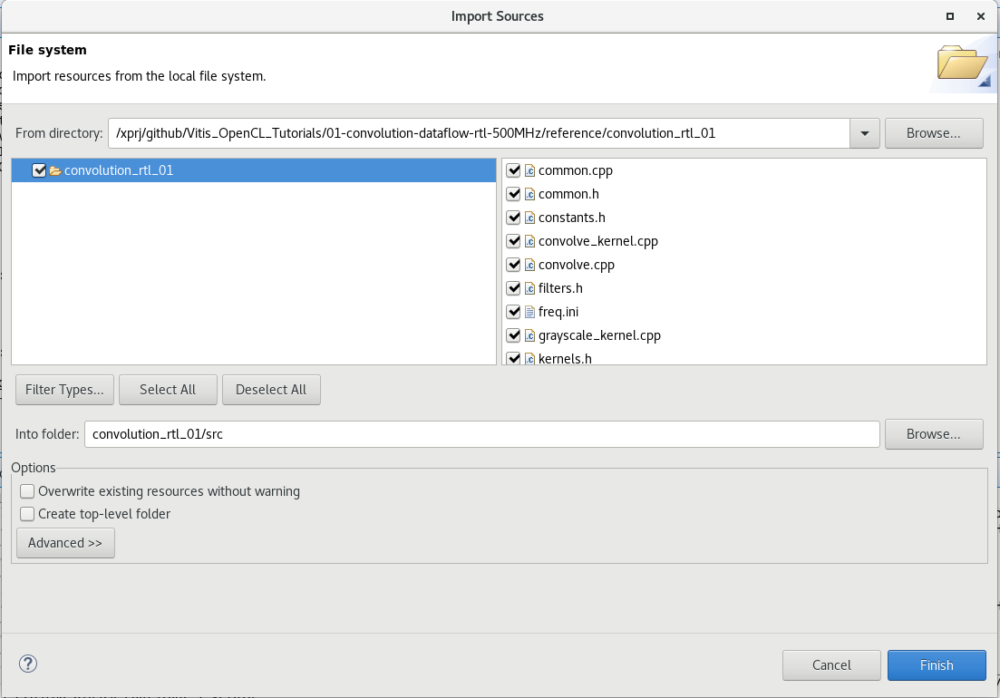

# Create application project

* Select "Import Source" in the context menu for project "convolution_rtl_01". Select source  directory 'repo_path'/reference/convolution_rtl_01. Select all files.

* Please note that convolve.cpp has changes in the arguments order and close streamOut
* Press "build" button

* Next step: [Create HW-Link project](./create_hw_link.md) 