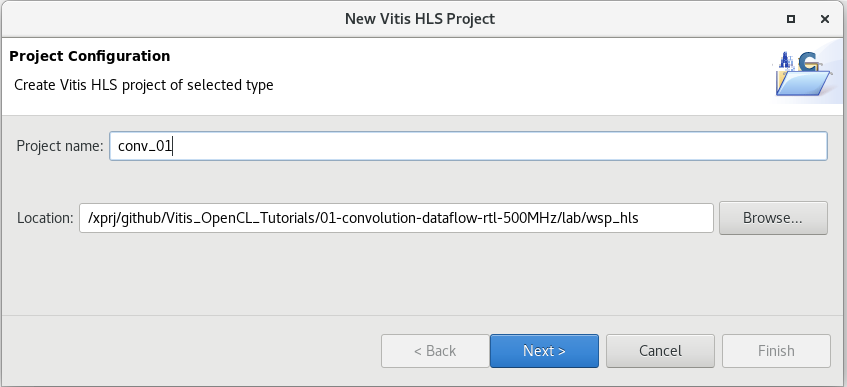
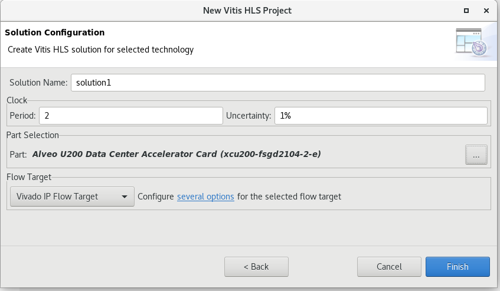
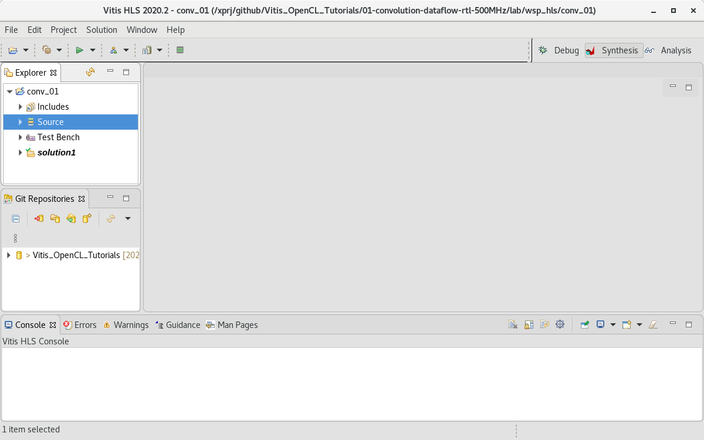
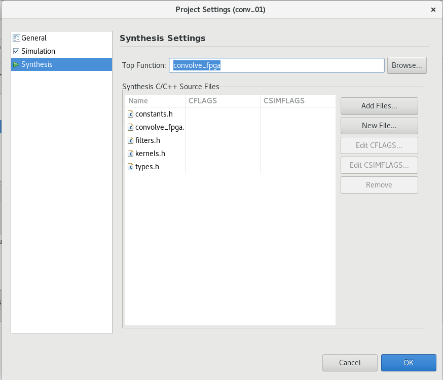
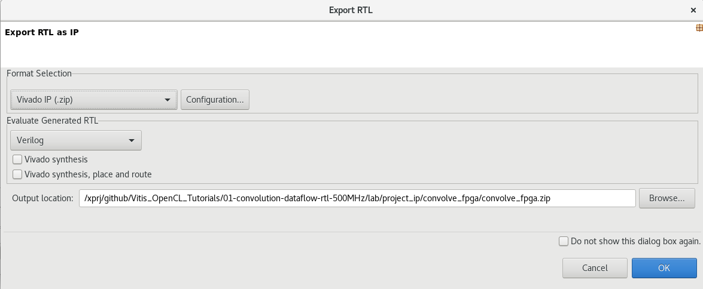

# Create HLS project

* open terminal
* setup environment : source /tools/Xilinx/Vitis/2020.2/settings64.sh 
* launch :           vitis_hls &
* launch "Create Project"
* enter project name  __conv_01__
* enter location:  __'repo_path'/lab/wsp_hls__

* Page "Add/Remove Design Files" - skip
* Page "Add/Remove Testbecnh Files" - skip
* Page setup solution:
* Period: 2
* Uncertainty: 1%
* Part: Alveo U200
* Flow Target: Vivado IP Flow Target

* copy files from  'repo_path'/reference/conv_01/* to 'repo_path'/lab/wsp_hls/conv_01
* add source files via contex menu of "Source", add all files from 'repo_path'/lab/wsp_hls/conv_01/src
* please notes that 'convolve_fpga.cpp' has changes from original file. Add 'offset=direct' in the lines with interface description: 

        #pragma HLS INTERFACE m_axi bundle=gmem1 port=inFrame offset=direct
        #pragma HLS INTERFACE m_axi bundle=gmem2 port=outFrame offset=direct
        #pragma HLS INTERFACE m_axi bundle=gmem3 port=coefficient offset=direct

* add testbecnh files via contex menu of "Test Becnh", add all files from 'repo_path'/lab/wsp_hls/conv_01/testbench
* setup convolve_fpga as top function in "Project/Setting/Synthesis"

* run synthesis
* export rtl: "Solution/Export RTL", enter output location: 'repo_path'/lab/project_ip/convolve_fpga

* unzip 'repo_path'/lab/project_ip/convolve_fpga/convolve_fpga.zip

* Next step:  [Create Vitis application project](./create_app_project.md) 

