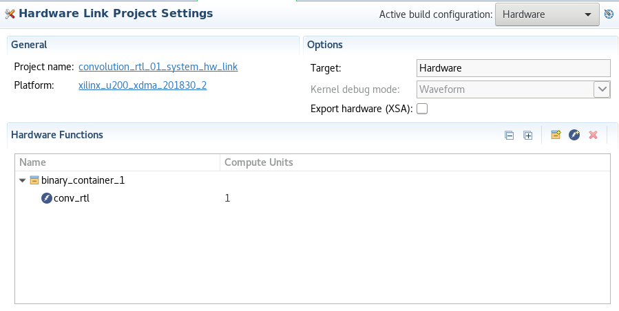

# Create HW-Link project
* Select convolution_rtl_01_system_hw_link.prj; You must see binary_container_1 and conv_rtl function in the project page. If you don't see its then add kernel function in the kernels project.

* Select convolution_rtl_01_system_hw_link project. Select "Import Source" in the context menu. Select <path>/reference/hw_lonk as source direcory and 

You must see freq.ini and options.txt in the hw_link projects.

* Open options.txt file. Change option --user_ip_repo_path. You need set path to <path>/lab/project_ip directory

* Select binary_container_1 in the project page and select "Edit V++ Options" in the context menu. Fill line option from the options.txt file

* Select "Hardware" for Active build configuration in the hw_link project page. Select "Build project" in the context menu for hw_link project. The binary_container_1.xclbin has been created. It takes several hours.