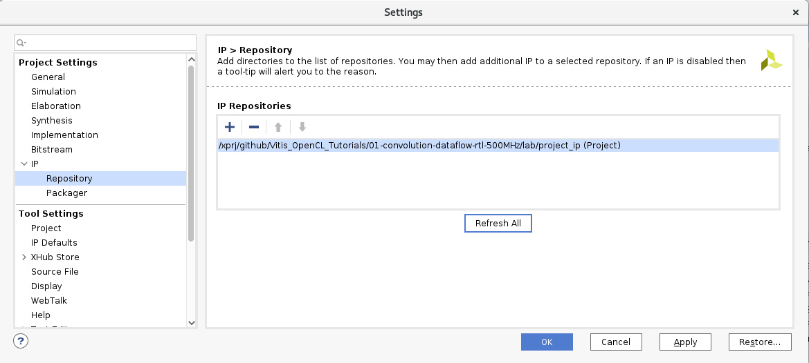
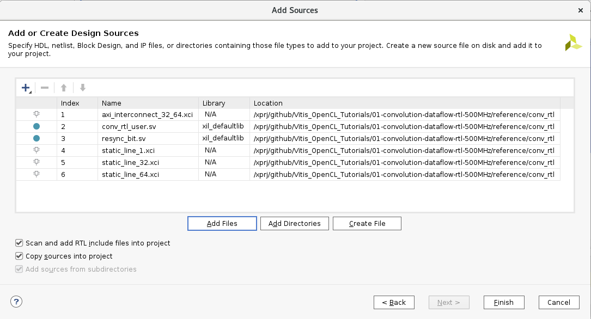
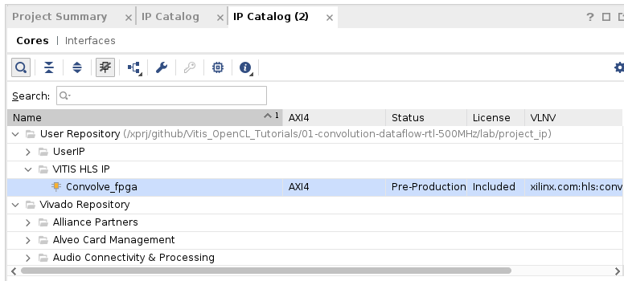
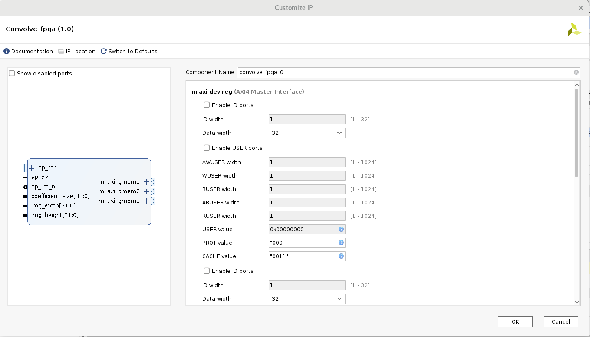
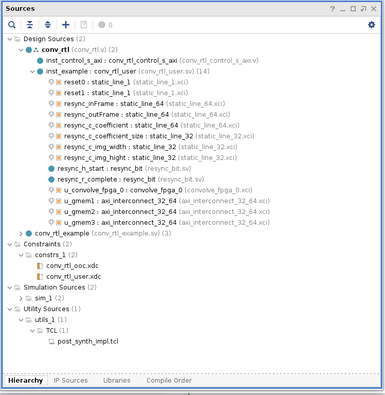
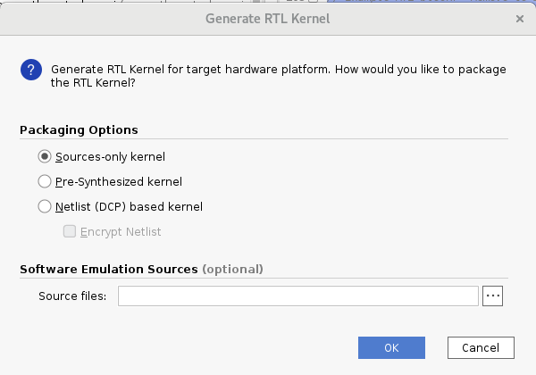
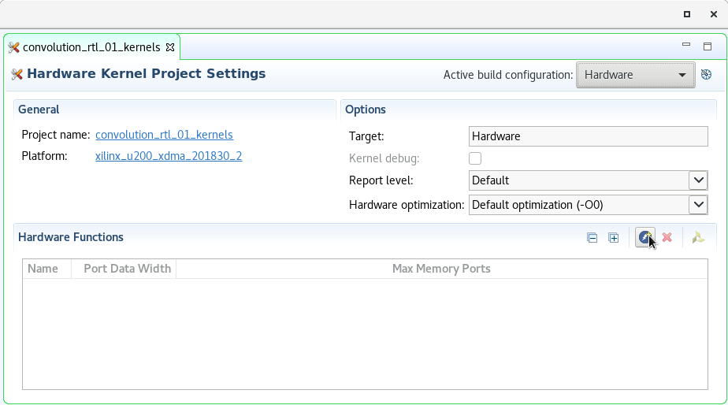
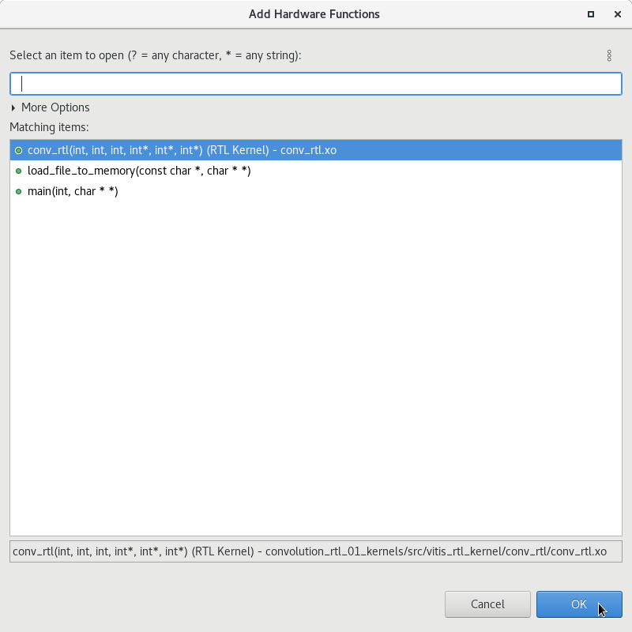

# Create RTL kernel
* In the Vitis project launch "Xilinx/Launch RTL Kernel wizard/convolution_rtl_01_kernels"
* next page
* enter kernel name: __conv_rtl__
* Number of clocks: 2
* Has reset: 1

* Number of scalar kernel input argument: 3
* enter arguments: coefficient_size, img_width, img_height
* select type for arguments: int

* Number of AXI master interface: 3
* enter interface names: gmem1, gmem2, gmem3
* select width: 8
* enter argument names: inFrame, outFrame, coefficient

* Streaming interface - no streaming, next
* Summury page:

* copy directory  <path>/reference/project_ip/static_line to <path>/lab/project_ip/

(Notes: you can copy others IP Core to <path>/lab/project_ip/) 

* Add path <path>/lab/project_ip as repositary path: Tools/Settings/IP/Reposytary

* Add design source files (*.sv and *.xci) from <path>/reference/conv_rtl; Please notes that "Copy sources into project" checkbox is selected.

* Launch "IP Catalog", select "User Repository/VITIS HLS IP/Convolve_fpga"

* keep all parameters, push "Ok"

* In vivado open file conv_rtl_ooc.xdc, change period 3.333 for ap_clk and 2.000 for ap_clk_2. Add false path for ap_clk and ap_clk_2. You must got such file:

        create_clock -period 3.333 [get_ports ap_clk]
        create_clock -period 2.000 [get_ports ap_clk_2]
        set_false_path  -from [get_clocs ap_clk] -to [get_clocks ap_clk_2]
        set_false_path  -from [get_clocs ap_clk_2] -to [get_clocks ap_clk]

    You can view result file into <path>/reference/conv_rtl

* Open file <path>/lab/wsp_vitis/convolution_rtl_01_kernels/vivado_rtl_kernel/conv_rtl_ex/imports/package_kernel.tcl; If you open the file in the vivado project then check that file is located in the directory __import__.
* Find line 56: "set_property value 250000000 $clkbifparam"
* Replace value for 300000000, it is value for ap_clk
* Find line 65: "set_property value 250000000 $clkbifparam"
* Replace value for 500000000, it is value for ap_clk_2

    You can view result file into <path>/reference/conv_rtl

* Open conv_rtl.v into vivado
* Find line 204: "conv_rtl_example #("
* Comment all lines for setup param of component conv_rtl_example
* Add line "conv_rtl_user" before line "inst_example (", you must got such code:

        // Example RTL block.  Remove to insert custom logic.
        //conv_rtl_example #(
        //  .C_GMEM1_ADDR_WIDTH ( C_GMEM1_ADDR_WIDTH ),
        //  .C_GMEM1_DATA_WIDTH ( C_GMEM1_DATA_WIDTH ),
        //  .C_GMEM2_ADDR_WIDTH ( C_GMEM2_ADDR_WIDTH ),
        //  .C_GMEM2_DATA_WIDTH ( C_GMEM2_DATA_WIDTH ),
        //  .C_GMEM3_ADDR_WIDTH ( C_GMEM3_ADDR_WIDTH ),
        //  .C_GMEM3_DATA_WIDTH ( C_GMEM3_DATA_WIDTH )
        //)
        conv_rtl_user
        inst_example (
        .ap_clk           ( ap_clk           ),
        .ap_rst_n         ( ap_rst_n         ),
        .ap_clk_2         ( ap_clk_2         ),
        .ap_rst_n_2       ( ap_rst_n_2       ),

* Open design hierarchy, check all instance

* Launch "Generate RTL Kernel", check "Source-only kernel". Please notes, you can add .cpp files for Emulation-SW mode.

* RTL kernel has been generated, you can exit from vivado

* You can reopen rtl kernel project and regenerate RTL kernel if you need it

* Select "convolution_rtl_01_kernels.prj". Press "Add Hardware Function" button;

* Select "conv_rtl" function

* Next step: [Create HW-Link project](./create_hw_link.md) 
