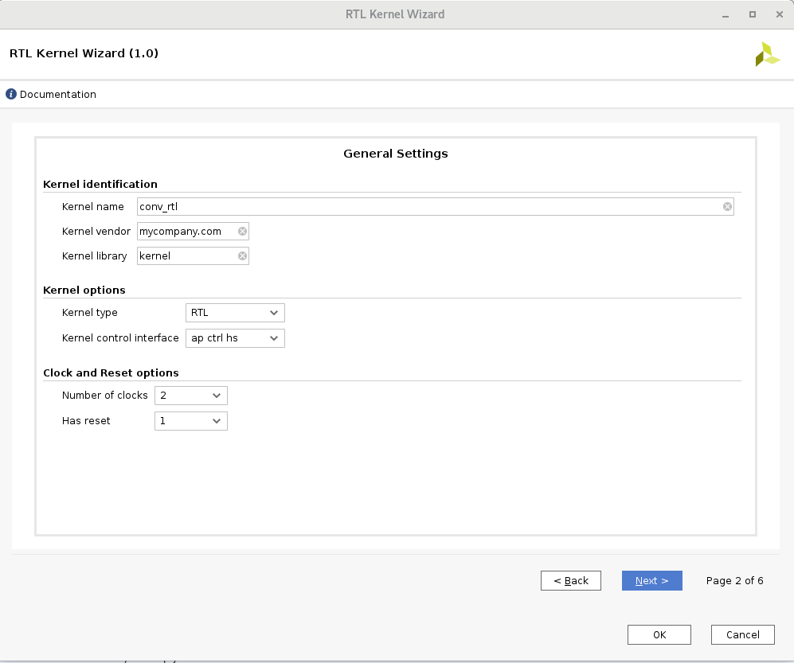
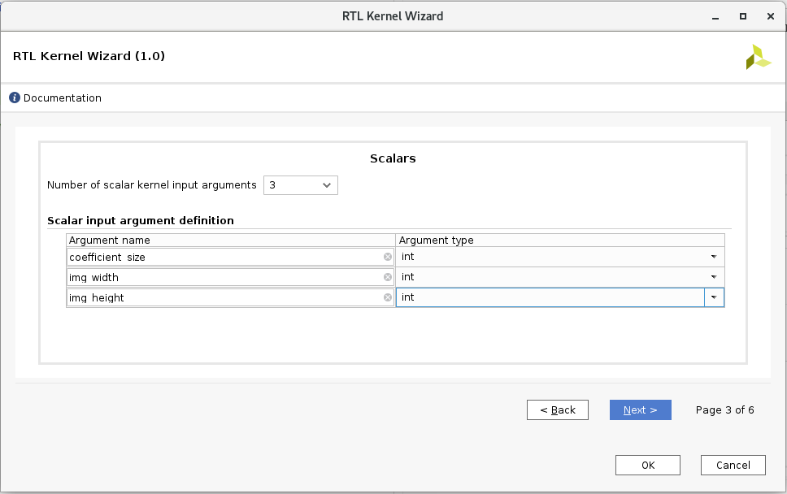
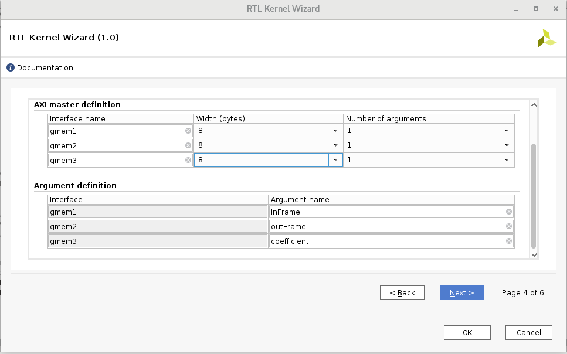
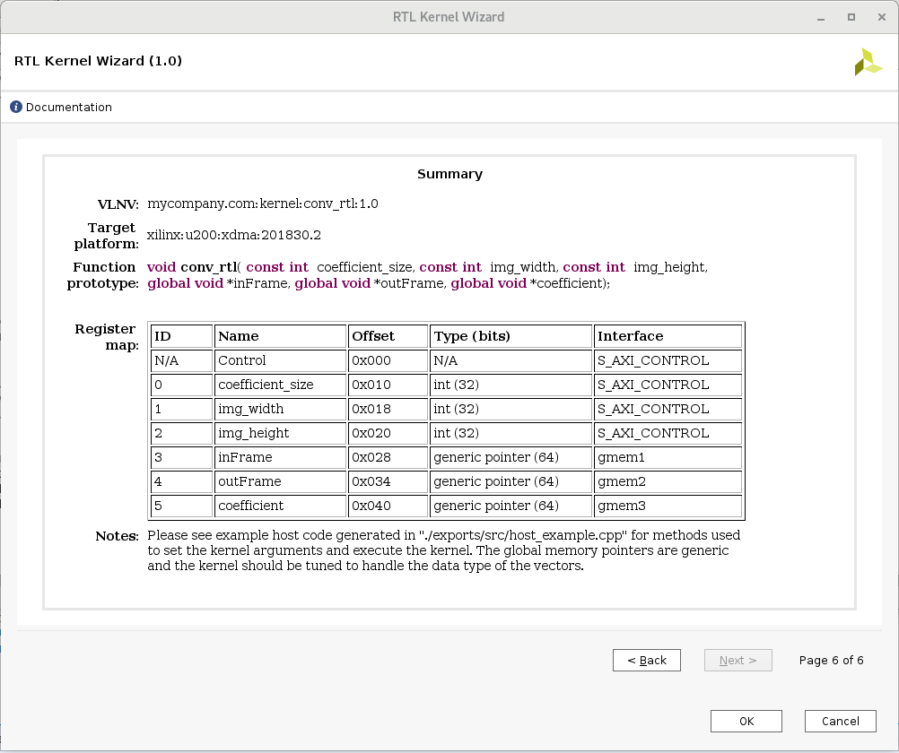

# Create RTL kernel
* In the Vitis project launch "Xilinx/Launch RTL Kernel wizard/convolution_rtl_01_kernels"
* next page
* enter kernel name: __conv_rtl__
* Number of clocks: 2
* Has reset: 1

* Number of scalar kernel input argument: 3
* enter arguments: coefficient_size, img_width, img_height
* select type for arguments: int

* Number of AXI master interface: 3
* enter interface names: gmem1, gmem2, gmem3
* select width: 8
* enter argument names: inFrame, outFrame, coefficient

* Streaming interface - no streaming, next
* Summury page:

* Next step: [Build  application project](./build_app_project.md) 
