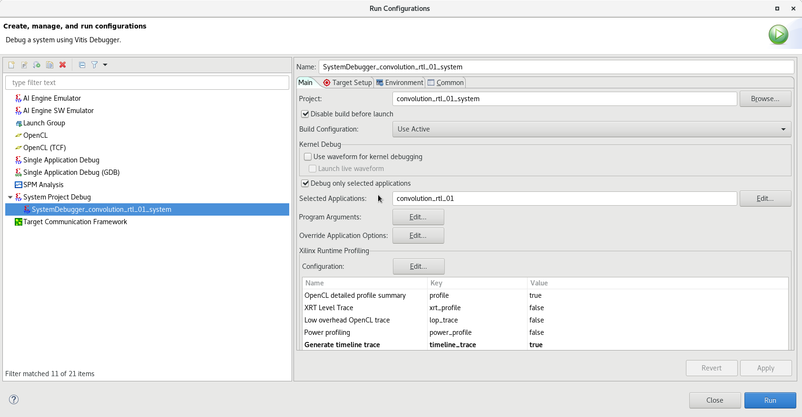
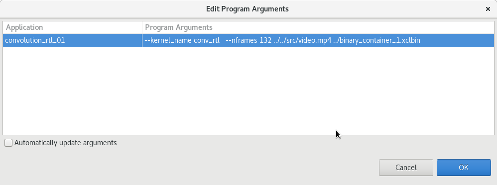
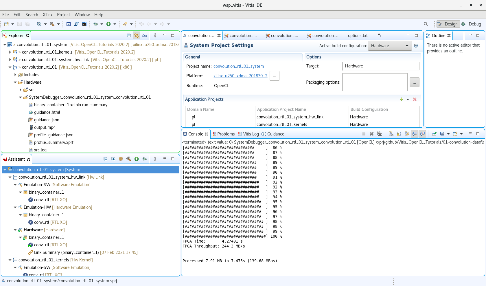

# Run example

* You must install ffmpeg package.
* Selet "Run Configurations..." in the "Run" button. 
* Select "System Project Debug". Select "New configuration" in the context menu.
* Select "Debug only selected application" and select "convolution_rtl_01"

* Press "Edit..." button near "Program Arguments:"
* For convolution_rtl_01  enter line: "--kernel_name conv_rtl --nframes 132 ../../src/video.mp4 ../binary_container_1.xclbin"

* Run application
* Open int the Explorer panel: convolution_rtl_01/Hardware/SystemDebugger_convolution_rtl_01_system_convolution_rtl_01; It is working directory for example. There is file output.mp4; It is result.

